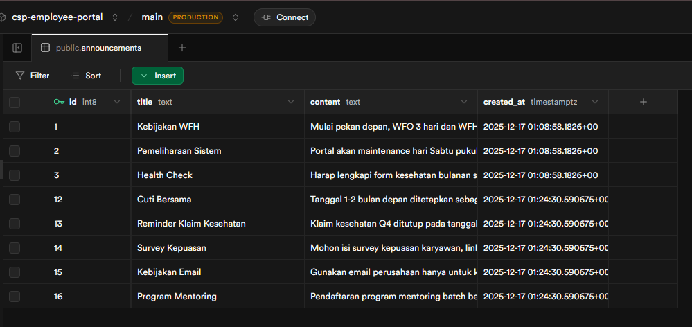

# Employee Portal

A secure Employee Portal built with **Next.js 16**, **Supabase**, and **Tailwind CSS**. This application uses server-side authentication, real-time data synchronization, and middleware-based route protection.

## 🎯 Features

- **Secure Authentication**: Server-side authentication using Supabase with Server Actions (no client-side auth logic)
- **Protected Routes**: Middleware-based route protection with automatic redirects
- **Session Management**: Automatic session refresh and cookie management
- **Responsive Design**: Modern UI built with Tailwind CSS and Geist fonts
- **Type-Safe**: Full TypeScript support with strict type checking

## 🛠 Tech Stack

- **Framework**: Next.js 16 (App Router)
- **Language**: TypeScript
- **Backend & Auth**: Supabase (PostgreSQL + Authentication)
- **Styling**: Tailwind CSS 4
- **Deployment**: Vercel

## 📋 Project Structure

```
src/
├── app/
│   ├── (auth)/                 # Auth route group
│   │   ├── login/
│   │   └── register/
│   ├── dashboard/              # Protected dashboard
│   ├── actions/                # Server actions
│   │   └── auth.ts
│   ├── layout.tsx
│   ├── page.tsx               # Home redirect
│   └── globals.css
├── components/
│   ├── auth-form.tsx          # Reusable auth UI
├── utils/
│   └── supabase/
│       └── server.ts          # Supabase server client
├── middleware.ts              # Route protection middleware
└── .env.local                 # Environment variables
```

## 🚀 Quick Start

### 1. Clone & Install

```bash
git clone https://github.com/AlynxNeko/csp-employee-portal.git
cd csp-employee-portal
npm install
```

### 2. Setup Supabase

1. Create a new project at [supabase.com](https://supabase.com)
2. Copy your **Project URL** and **Anon Key** from Settings → API
3. Create `.env.local` with:
   ```env
   NEXT_PUBLIC_SUPABASE_URL=https://your-project.supabase.co
   NEXT_PUBLIC_SUPABASE_ANON_KEY=your-anon-key
   ```

### 3. Create Database

Run the SQL from `db.sql` in your Supabase SQL editor:

```sql
create table if not exists announcements (
  id bigint generated always as identity primary key,
  title text not null,
  content text not null,
  created_at timestamptz not null default now()
);
```

Insert sample data (included in `db.sql`).

### 4. Enable Real-time (Optional)

In Supabase dashboard → Database → Publications:
- Enable realtime for `announcements` table

### 5. Run Locally

```bash
npm run dev
```

Open [http://localhost:3000](http://localhost:3000) and sign up!

## 📸 Screenshots

### Database Schema

The `announcements` table stores employee notifications:



## 🔐 Authentication Flow

1. **Register** → User creates account via Supabase Auth
2. **Login** → Server action validates credentials and creates session
3. **Middleware** → Protects `/dashboard` route, redirects unauthenticated users to `/login`
4. **Dashboard** → Displays user email and real-time announcements
5. **Logout** → Clears session and redirects to login

## 📦 Deployment

### Deploy to Vercel

1. Push code to GitHub
2. Connect repository in [Vercel Dashboard](https://vercel.com)
3. Set environment variables:
   - `NEXT_PUBLIC_SUPABASE_URL`
   - `NEXT_PUBLIC_SUPABASE_ANON_KEY`
4. Deploy!

**Live Demo**: [csp-employee-portal.vercel.app](https://csp-employee-portal.vercel.app)

## 🏗 Architecture Highlights

### Server Actions (Security)
- All auth logic runs server-side only
- No credentials exposed to client
- Type-safe form handling

### Middleware (Route Protection)
- Session verification on every request
- Automatic token refresh
- Seamless redirects (no infinite loops)

## 📝 API Routes & Actions

| Route | Method | Purpose |
|-------|--------|---------|
| `/register` | POST | Create new account |
| `/login` | POST | Authenticate user |
| `/dashboard` | GET | Display user profile & announcements |
| `/logout` | POST | Sign out and clear session |

## 🔧 Environment Variables

```env
# Required
NEXT_PUBLIC_SUPABASE_URL=https://your-project.supabase.co
NEXT_PUBLIC_SUPABASE_ANON_KEY=sbp_...
```

## 📚 Learn More

- [Next.js 16 Docs](https://nextjs.org/docs)
- [Supabase Auth Docs](https://supabase.com/docs/guides/auth)
- [Server Actions Guide](https://nextjs.org/docs/app/building-your-application/data-fetching/server-actions-and-mutations)
- [Middleware Docs](https://nextjs.org/docs/app/building-your-application/routing/middleware)

## 📄 License

MIT © 2025

---

**Built for Client Side Programming (CSP) Final Project Assignment** | Semester 7
